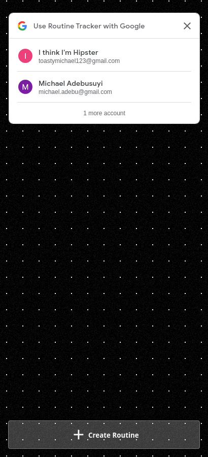
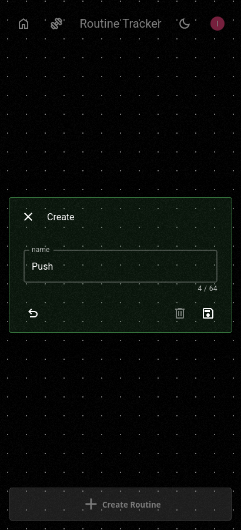
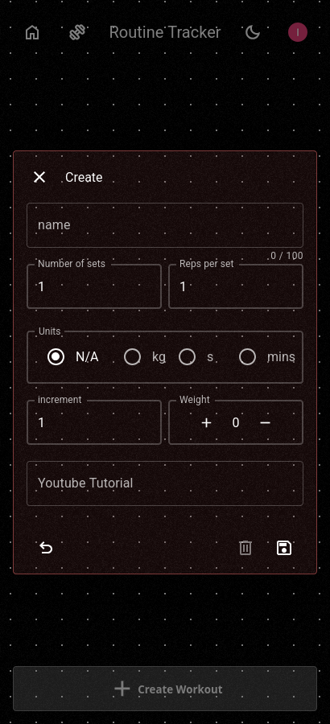
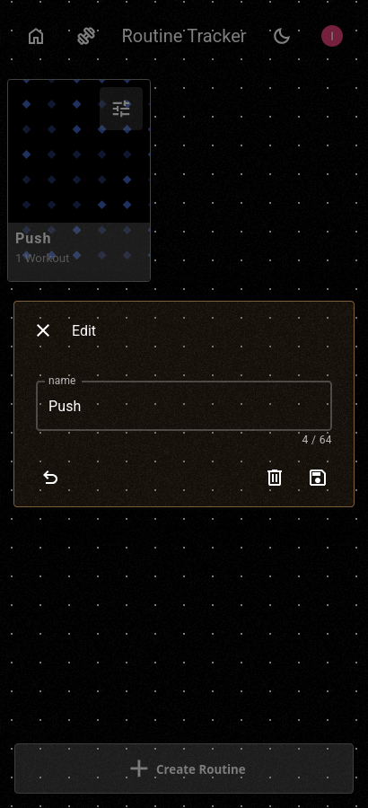
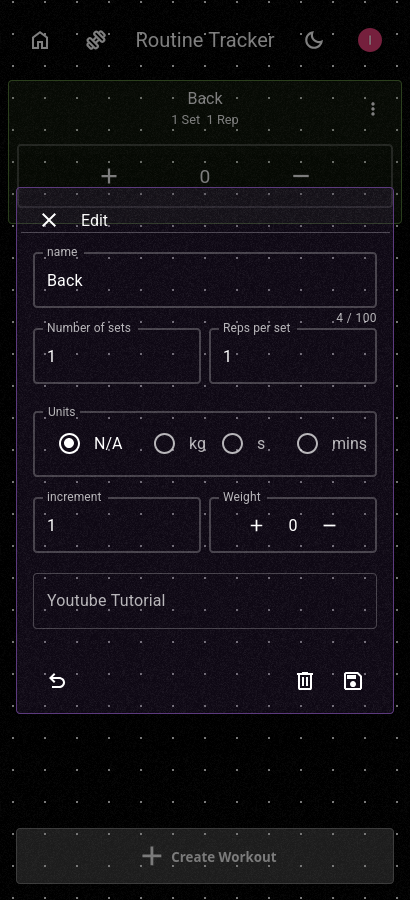
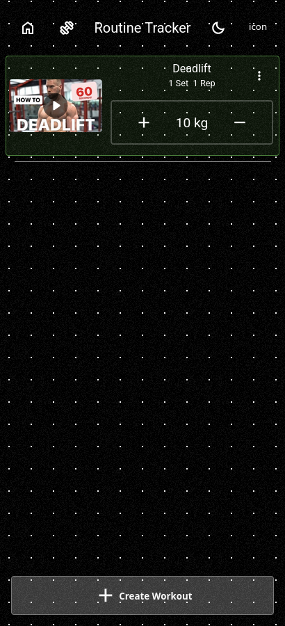
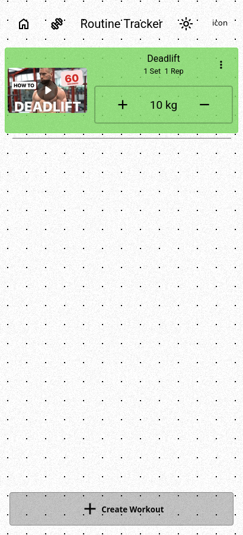

  <a href="https://machrino.me">
    </img>
  </a>
  <h3 align="center">Trackout</h3>
  

    A Revamp of my original project: <a href="https://github.com/FrontRowWithJ/gym-routine-tracker">Gym Routine Tracker<a/>.
     
    A PWA designed to monitor your progress, add personalised excercises and accompany them with tutorial videos.
  

  
Table of Contents

  <ol>
    <li>
      <a href="#about">About</a>
    </li>
    <li>
      <a href="#built-with">Built With</a>
    </li>
    <li>
      <a href="#guide">Guide</a>
    </li>
  </ol>

## About

The purpose of this project was to address the issues found in the original project which were:

- Slow and cumbersome UI.
- Slow load times.
- Inconsistent db storage.
- Unable to create custom routines.

## Built With

The frontend was built with:\
[![React][react-badge]][react-url]
[![Typescript][typescript-badge]][typescript-url]
[![HTML][html-badge]][html-url]
[![CSS][css-badge]][css-url]

The backend was built with:\
[![mysql][mysql-badge]][mysql-url]
[![docker][docker-badge]][docker-url]
[![golang][golang-badge]][golang-url]
[![jsonwebtokens][jsonwebtokens-badge]][jsonwebtokens-url]
[![traefikproxy][traefikproxy-badge]][traefikproxy-url]

## Guide

  
   
   
   
   
  <h3 align="left">You can start by signing in with Google but you can use the app without creating an account.</h3>
   
   
   
   

  
   
   
   
   
  <h3 align="left">Next, create a routine. You can name it whatever</h3>
   
   
   
   

  
   
   
   
   
  <h3 align="left">Next, create a workout. You can name it whatever</h3>
   
   
   
   

  
  
   
   
   
   
  <h3 align="left">You can edit your routines and workouts. </h3>
   
   
   
   

  
   
   
   
   
  <h3 align="left">Increment/Decrement the weight amount or play the workout video.</h3>
   
   
   
   

  
  
   
   
   
   
  <h3 align="left">You can also toggle between light and dark mode!</h3>
   
   
   
   

[react-badge]: https://img.shields.io/badge/React-20232A?style=for-the-badge&logo=react&logoColor=61DAFB
[react-url]: https://reactjs.org/
[typescript-badge]: https://shields.io/badge/TypeScript-3178C6?style=for-the-badge&logo=TypeScript&logoColor=FFF
[typescript-url]: https://www.typescriptlang.org/
[html-badge]: https://img.shields.io/badge/HTML5-E34F26?style=for-the-badge&logo=html5&logoColor=white
[html-url]: https://en.wikipedia.org/wiki/HTML
[css-badge]: https://img.shields.io/badge/CSS3-1572B6?style=for-the-badge&logo=css3&logoColor=white
[css-url]: https://en.wikipedia.org/wiki/CSS
[mysql-badge]: https://img.shields.io/badge/MySQL-4479A1?style=for-the-badge&logo=mysql&logoColor=white
[mysql-url]: https://www.mysql.com
[docker-badge]: https://img.shields.io/badge/Docker-2496ED?style=for-the-badge&logo=docker&logoColor=white
[docker-url]: https://www.docker.com
[golang-badge]: https://img.shields.io/badge/Golang-00ADD8?style=for-the-badge&logo=go&logoColor=white
[golang-url]: https://go.dev
[jsonwebtokens-badge]: https://img.shields.io/badge/JWT-000000?style=for-the-badge&logo=jsonwebtokens&logoColor=white
[jsonwebtokens-url]: https://jwt.io
[traefikproxy-badge]: https://img.shields.io/badge/traefik-24A1C1?style=for-the-badge&logo=traefikproxy&logoColor=white
[traefikproxy-url]: https://doc.traefik.io/traefik/
